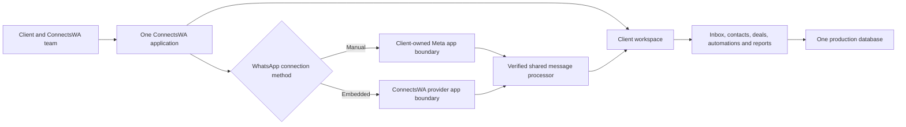
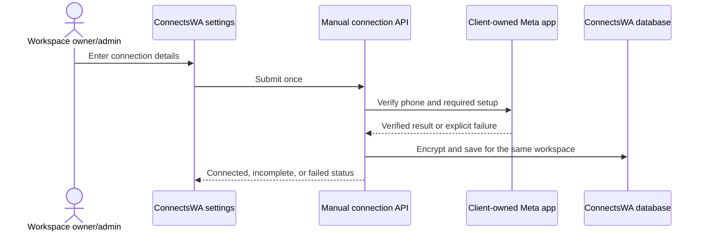
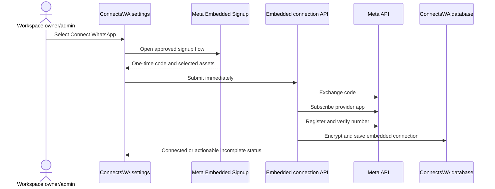

# ConnectsWA Unified WhatsApp Onboarding System Design

| Document control | Value                                                           |
| ---------------- | --------------------------------------------------------------- |
| Document ID      | CODEX-SDD-WA-001                                                |
| Status           | Proposed for final review                                       |
| Version          | 1.0                                                             |
| Date             | 2026-08-10                                                      |
| Author           | Codex                                                           |
| Business owner   | Manish                                                          |
| System           | ConnectsWA                                                      |
| Decision record  | `decisions/codex-adr-001-one-product-two-onboarding-methods.md` |
| Release gates    | `codex-whatsapp-onboarding-rollout-and-acceptance.md`           |

## 1. Executive decision

ConnectsWA will remain one product with one permanent production deployment,
one production domain, one production database, and one workspace per client.

The product will support two ways to connect a client's WhatsApp account:

1. **Manual client-owned Meta app** — the initial go-to-market method. Manish
   collects the client's Meta connection details and saves them in that
   client's ConnectsWA workspace.
2. **ConnectsWA Embedded Signup** — the later self-service method, enabled only
   after the ConnectsWA provider app has passed Meta approval and production
   acceptance testing.

These are connection methods inside the same product. They are not separate
applications, subscriptions, hosting systems, databases, inboxes, or customer
portals.

Existing manual clients will not be required to reconnect through Embedded
Signup. If their connection works, it remains in place. Embedded Signup becomes
the preferred route for new clients after approval; the manual route remains an
operational fallback.

## 2. Business outcomes

After implementation:

- Manish can enter the market without waiting for Meta provider-app approval.
- Multiple manual clients can operate simultaneously, even though each client
  uses a different client-owned Meta app.
- Embedded Signup can be developed and reviewed without changing the experience
  of live manual clients.
- After approval, a new client can connect from the same ConnectsWA settings
  page through Meta's popup.
- Manual and Embedded Signup clients use the same inbox, contacts, deals,
  automations, reports, team access, and account model.
- A failure in the Embedded Signup entry point does not disconnect or alter a
  manual client.
- Embedded Signup can be hidden for new connections without disabling clients
  who already use it.
- ConnectsWA-held history does not move when the connection method changes in a
  future, optional migration. The workspace remains the same.

## 3. Scope

### 3.1 In scope

- Reliable multi-client manual onboarding using client-owned Meta apps.
- Per-client webhook verification for manual connections.
- One ConnectsWA provider Meta app for Embedded Signup.
- A separate provider webhook endpoint on the same ConnectsWA domain.
- Shared processing after a webhook has been authenticated.
- One active WhatsApp connection per ConnectsWA workspace.
- Explicit recording of whether a connection is manual or embedded.
- Encrypted credential storage.
- Role-restricted connection management.
- A release switch that hides Embedded Signup until it is approved.
- Isolated development and acceptance testing before production enablement.
- Meta-required provider callbacks and lifecycle-event handling.
- Operational diagnostics, failure isolation, monitoring, and rollback.

### 3.2 Out of scope

- Forcing existing manual clients to migrate.
- Bulk migration of manual clients.
- Two permanent ConnectsWA production systems.
- Separate client databases for the two onboarding methods.
- Multiple WhatsApp numbers in one workspace.
- WhatsApp Business mobile-app coexistence or mobile-app chat-history sync.
- Changing or removing Meta's client prerequisites.
- Storing a client's Facebook password.
- Building token-refresh infrastructure when the approved Meta configuration
  can issue a non-expiring business token.

## 4. Guiding principles

1. **The workspace owns the business history.** Contacts, conversations,
   messages, notes, deals, automations, reports, and team membership remain
   attached to the workspace, not to a Meta app or onboarding method.
2. **Connection methods share outcomes, not secrets.** Both methods feed the
   same CRM, but their webhook verification and sensitive credentials remain
   isolated.
3. **Working clients are not experimental subjects.** Embedded Signup is
   developed and validated without altering active manual connections.
4. **No silent success.** A connection is not presented as ready when required
   Meta subscription or registration steps have failed.
5. **No silent downgrade.** Re-saving credentials or encountering a transient
   Meta error must not turn a previously live connection into a disconnected
   one.
6. **One-way release safety.** New Embedded Signup onboarding can be disabled
   independently; already-connected embedded clients continue operating.
7. **Test isolation is not product duplication.** A private preview environment
   protects production data but does not become a second customer platform.

## 5. User journeys

### 5.1 Initial manual client

1. A ConnectsWA workspace is created for the client.
2. Manish collects the client-owned Meta app connection details.
3. An owner or administrator saves those details in the workspace.
4. ConnectsWA verifies the connection, registers the number where required,
   and confirms webhook subscription status.
5. The client begins using the standard ConnectsWA inbox and CRM.

**Result:** the client receives the complete ConnectsWA product without waiting
for the ConnectsWA provider app to be approved.

### 5.2 New client after Embedded Signup approval

1. A ConnectsWA workspace is created for the client.
2. The owner or administrator selects **Connect WhatsApp**.
3. The client completes Meta's Embedded Signup popup.
4. ConnectsWA completes the server-side connection steps and saves the result.
5. The same ConnectsWA inbox and CRM become active.

**Result:** the onboarding effort is reduced, but the delivered product and data
model are identical to the manual route.

### 5.3 Existing manual client after Embedded Signup launch

No action occurs. The settings page continues to show the client's working
manual connection. ConnectsWA does not automatically open Embedded Signup,
replace credentials, or ask the client to reconnect.

**Result:** releasing Embedded Signup has zero required impact on existing
manual clients.

### 5.4 Optional future manual-to-embedded move

This is not part of the initial implementation. If it is introduced later, it
must be an explicit, scheduled operation. Only the WhatsApp connection may be
replaced; the workspace ID and all workspace-owned records remain unchanged.
The old connection must remain recoverable until an end-to-end send and receive
test succeeds.

**Result:** ConnectsWA history remains intact without exporting, copying, or
re-importing CRM data.

## 6. Logical architecture

### 6.1 Permanent production topology

- One ConnectsWA codebase.
- One production deployment.
- One production domain.
- One production Supabase project/database.
- One authentication and workspace model.
- One CRM data model.
- Two isolated WhatsApp connection boundaries.
- One shared processor after each boundary has authenticated the event.

### 6.2 Development topology

Embedded Signup requires HTTPS callbacks and must be tested without exposing
paying clients to unfinished provider-app behavior. Development therefore uses:

- the same repository and hosting provider;
- a private preview or staging deployment;
- a fixed HTTPS test hostname while Meta configuration is being validated; and
- an isolated test database containing no production client data.

This environment is a safety control, not a second product. It has no separate
customer onboarding, billing, support process, or production data. Production
remains the only live customer system.

## 7. Component responsibilities

### 7.1 ConnectsWA settings experience

The settings page is the single place where an owner or administrator manages
the WhatsApp connection.

- Before provider approval, the manual form is available and Embedded Signup is
  hidden.
- After provider approval, **Connect WhatsApp** is the primary option for an
  unconnected workspace.
- The manual form remains available as an advanced/fallback option.
- A connected manual workspace displays its status and is not prompted to move.
- Sensitive values are write-only and never returned to the browser after save.

### 7.2 Manual connection boundary

The manual boundary accepts client-owned Meta details, verifies them, encrypts
the credentials, and identifies which client secret must authenticate an
incoming webhook.

Each manual client's failure is isolated. An invalid secret or token for one
workspace must not interrupt webhook processing for another workspace.

### 7.3 Embedded Signup boundary

The embedded boundary launches Meta's popup, receives the short-lived result,
completes the required server-side Meta calls, and saves an embedded connection.

It uses the ConnectsWA provider app's deployment credentials. The provider App
Secret is never copied into an individual workspace record.

### 7.4 Connection persistence service

Both entry points must use one server-side persistence service for common
invariants:

- one active phone number per workspace;
- the same phone number cannot belong to two workspaces;
- sensitive credentials are encrypted before storage;
- connection method is recorded explicitly;
- a live connection is never downgraded by a transient registration failure;
- no clean-success response is returned when required activation steps failed;
- browser responses contain sanitized status only.

The current manual route must be characterized by tests before this common logic
is extracted. The refactor is released and verified separately from the new
Embedded Signup behavior.

### 7.5 Webhook boundaries and shared processor

Manual and provider webhooks use separate paths on the same domain.

- The manual webhook resolves the intended workspace and verifies the untouched
  payload with that client's App Secret.
- The provider webhook verifies the untouched payload with the ConnectsWA
  provider App Secret.
- Neither boundary falls back to the other boundary's secret.
- Only verified events reach the shared message processor.
- The shared processor resolves the workspace and performs the existing inbox,
  status, automation, and notification work.

This separation prevents provider changes from destabilizing the live manual
webhook while avoiding two copies of the business-processing logic.

### 7.6 Provider lifecycle callbacks

The provider implementation includes Meta-required deauthorization and
data-deletion callbacks plus the required account lifecycle webhook handling.
Removal of the provider app marks the affected embedded connection as requiring
attention; it does not affect manual workspaces.

## 8. Data ownership and model

### 8.1 Workspace-owned data

The following remain account/workspace scoped and are not recreated when a
WhatsApp connection is established:

- contacts and tags;
- conversations and messages;
- notes and custom fields;
- deals and pipelines;
- broadcasts and templates stored in ConnectsWA;
- automations, flows, and execution history;
- reports, activity, and team membership.

The existing account-scoped schema already provides the required foundation.

### 8.2 Connection record

ConnectsWA retains one active WhatsApp configuration per workspace. The design
adds only the metadata required to distinguish and safely operate the two
methods:

- `connection_method`: `manual` or `embedded`;
- per-client encrypted App Secret for manual connections;
- provider App Secret only in server environment configuration;
- existing phone number, WABA, token, registration, subscription, and status
  fields;
- sanitized diagnostic state where needed by the UI.

An embedded connection does not require a per-workspace App Secret or manual
webhook verify token. A manual connection does not use the provider App Secret.

### 8.3 History-preservation invariant

No onboarding route may create a replacement ConnectsWA account merely because
the connection method differs. The workspace's immutable identity is the anchor
for CRM history.

## 9. Connection flows

### 9.1 Manual activation

### 9.2 Embedded activation

## 10. Failure handling

| Failure                              | Required outcome                                                                                                                                  |
| ------------------------------------ | ------------------------------------------------------------------------------------------------------------------------------------------------- |
| Manual credentials invalid           | Reject the change; leave any previously working connection unchanged.                                                                             |
| Manual webhook signature invalid     | Reject the event with no side effects. Other clients continue normally.                                                                           |
| Embedded Signup script blocked       | Explain the problem and offer the manual method.                                                                                                  |
| Embedded code exchange fails         | Save no active embedded connection; offer a clean retry.                                                                                          |
| Provider app subscription fails      | Do not report the connection as ready. Save no active embedded connection.                                                                        |
| Number registration is incomplete    | Preserve verified connection information, show an actionable incomplete state, and provide a retry; never downgrade a previously live connection. |
| Provider webhook signature invalid   | Reject the event with no side effects. Manual webhook processing remains independent.                                                             |
| Provider configuration disabled      | Hide new Embedded Signup entry; existing embedded connections continue operating.                                                                 |
| Provider app removed by a client     | Mark only that embedded workspace as requiring reconnection.                                                                                      |
| Production release causes regression | Disable new Embedded Signup onboarding first; do not roll back routes required by existing embedded clients.                                      |

## 11. Security and privacy requirements

- Only workspace owners and administrators may create, replace, or remove a
  WhatsApp connection.
- Access tokens, App Secrets, verification tokens, authorization codes, and PINs
  must never be logged.
- Stored client tokens and secrets use the existing AES-256-GCM encryption
  mechanism.
- Sensitive credential reads occur only on the server.
- API responses expose masked presence and sanitized connection status, never
  ciphertext or plaintext credentials.
- Webhook HMAC verification is completed against the untouched raw body before
  any business side effect.
- Unknown workspaces, unknown phone numbers, and missing secrets fail closed.
- Manual and provider secrets never act as fallbacks for one another.
- Deauthorization and data-deletion requests are cryptographically verified.
- Production data must not be copied into the Embedded Signup test database.

## 12. Reliability and observability

The system must make silent connection failure visible without exposing secrets.

Minimum operational signals:

- count of verified and rejected webhook deliveries by connection method;
- unknown WABA/phone-number routing failures;
- Meta subscription and registration failures;
- last successful inbound event per workspace;
- last successful outbound send per workspace;
- provider lifecycle events and reconnection-required states;
- Embedded Signup completion and failure category, without codes or tokens;
- alerts for sustained webhook rejection or a previously active workspace going
  quiet beyond an agreed operational threshold.

Logs must contain a workspace-safe correlation identifier and sanitized Meta
error category. They must not contain request bodies from credential routes.

## 13. Quality strategy

### 13.1 Automated verification

- Unit tests for encryption boundaries and signature verification.
- Manual webhook tests using two different client secrets.
- Cross-tenant rejection tests.
- Characterization tests for existing connection persistence before refactoring.
- No-downgrade regression tests.
- Embedded orchestration tests for every external call and failure stage.
- Provider webhook and signed-callback verification tests.
- Route authorization tests for owner, administrator, agent, and viewer roles.
- Existing inbox, message status, automation, and template test suites remain
  green.
- Type checking, linting, full tests, and production build pass before release.

### 13.2 Acceptance verification

- Two manual workspaces on two client-owned Meta apps receive and send
  independently.
- Existing manual workspaces remain live while Embedded Signup code is deployed
  but disabled.
- A new test workspace completes Embedded Signup end to end in the private test
  environment.
- Manual and embedded test workspaces feed the same CRM features without data
  crossing between them.
- Disabling new Embedded Signup onboarding leaves existing connections live.

Detailed gates are defined in
`codex-whatsapp-onboarding-rollout-and-acceptance.md`.

## 14. Delivery sequence

### Phase A — manual market entry

1. Implement per-client manual App Secret support.
2. Correct the silent inbound, no-downgrade, and subscription-reporting defects.
3. Verify two independent manual workspaces.
4. Release manual onboarding to production.
5. Begin controlled client onboarding.

### Phase B — Embedded Signup development in parallel

1. Prepare the provider Meta app and fixed HTTPS test configuration.
2. Build Embedded Signup in the same repository.
3. Use a private preview deployment and isolated test database.
4. Complete automated and end-to-end acceptance testing.
5. Submit and progress Meta review.

### Phase C — unified production release

1. Deploy Embedded Signup code with new onboarding disabled.
2. Confirm all manual workspaces remain healthy.
3. Complete final provider-app approval and production verification.
4. Enable Embedded Signup for unconnected/new workspaces.
5. Keep manual workspaces unchanged and retain the manual fallback.

## 15. Risks and controls

| Risk                                                               | Control                                                                                         |
| ------------------------------------------------------------------ | ----------------------------------------------------------------------------------------------- |
| One global manual App Secret drops other clients' inbound messages | Store and select the correct encrypted per-client App Secret.                                   |
| New provider work destabilizes manual clients                      | Separate webhook boundaries; shared processing only after verification; release disabled first. |
| Duplicate product and data stacks emerge                           | One permanent production domain, database, workspace model, and CRM.                            |
| A test changes a paying client's data                              | Isolated test database and test Meta assets.                                                    |
| UI reports success while inbound cannot work                       | Subscription failure is visible and blocks clean activation.                                    |
| Re-save disconnects a live client                                  | Verify before replacement and enforce the no-downgrade invariant.                               |
| Provider approval is delayed                                       | Manual onboarding remains the production go-to-market route.                                    |
| A future migration threatens history                               | Keep the workspace ID unchanged; treat migration as connection replacement only.                |
| Meta behavior for an already-connected number is uncertain         | Do not promise or implement migration in this release; validate separately before adding it.    |

## 16. Decisions fixed by this design

- One ConnectsWA product, not two.
- One permanent production hosting setup and database.
- Two onboarding methods within the same settings experience.
- Manual onboarding launches first.
- Embedded Signup is built in parallel and enabled only after approval.
- Existing manual clients remain manual when working.
- The manual path remains available after Embedded Signup launches.
- ConnectsWA history belongs to the workspace and is never copied merely because
  of an onboarding-method change.
- A private test environment is required, but it is not a second customer
  product.

## 17. Source documents and precedence

This document consolidates the business direction and relevant verified details
from:

- `../../../embedded-signup-implementation-recommendation.md`
- `../phase-1/P1-10-whatsapp-connection-architecture.md`
- `../phase-1/P1-11-embedded-signup.md`

If an earlier draft implies two permanent production systems, mandatory
migration of manual clients, or replacement of a working manual connection as a
release requirement, this final design takes precedence after approval.

Implementation details that can drift with Meta or the installed Next.js version
must be rechecked at implementation time against current primary documentation
and the repository's `AGENTS.md` instructions.
